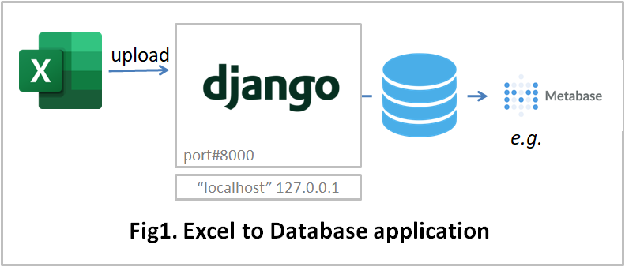

# Excel to Database application

# 1. What you can do

* To accumulate excel forms to the database. 
* To learn the django application.

 

 

# 2. How to use

* Install the prerequisite python libraries

* Environment setting
  * Edit settings.py
    * set PYTHON_EXE_FILE

 

* Program start
  * cd e2dproject-django
  * python.exe manage.py runserver 8000

 

* Open browser
  * http://localhost:8000/
  * Login Email address/Password: sakura.suwa@example.com/helloe2d

 

# 3. System
* OS: Windows 10, Ubuntu 20.04.6 LTS)
* Web Framework: Django
* Python 3.12.7
* Python Libraries: See requirements.txt
* Bootstrap 5.2.3
* jQuery 3.7.1
* Database: SQLite3

 

# 4. Undisclosed Functions
* Authentication(Sign up, Change password)
* Database(PostgreSQL, MongoDB)
* Machine Learning

 

# 5. Initialization
(1) To sign-up a database administrator [UNDISCLOSED] 
(2) The database administrator submits the following control files: [UNDISCLOSED] 
   * database_info_entry.xlsx 
   * group_info_entry.xlsx(group administrators information) 

(3) To sigh-up a group administrator [UNDISCLOSED] 
(4) The group administrator submits the following control files: 
  * form_info_entry.xlsx(sumittable forms information） 
  * group_info_entry.xlsx(user information)

 

# 6. Directories and Files Overview

| Directory/File |D/F| description |
| :------------- | :-| :---------- |
| accounts |Dir | login processing |
| apps/appmain | Dir | main programs |
| apps/appml | Dir | machine learning [UNDISCLOSED] |
| apps/topview | Dir ||
| database | Dir ||
| download | Dir | sample data files |
| e2dproject | Dir | Django settings.py, etc. |
| log | Dir ||
| static | Dir ||
| templates | Dir ||
| manage.py  | File ||
| READMD.md | File ||
| requirements.txt | File | prerequisite libraries |
